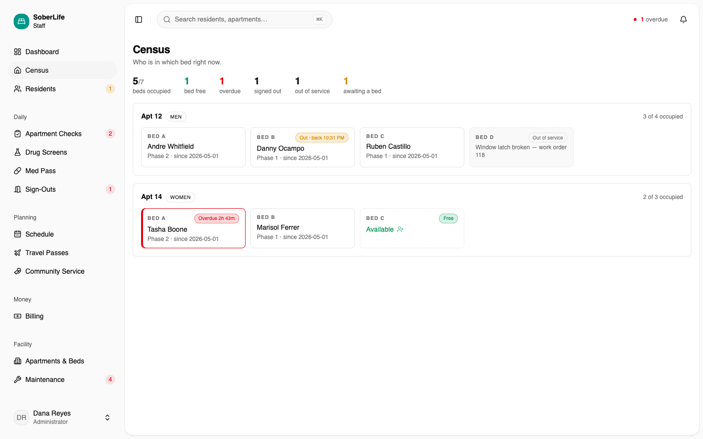
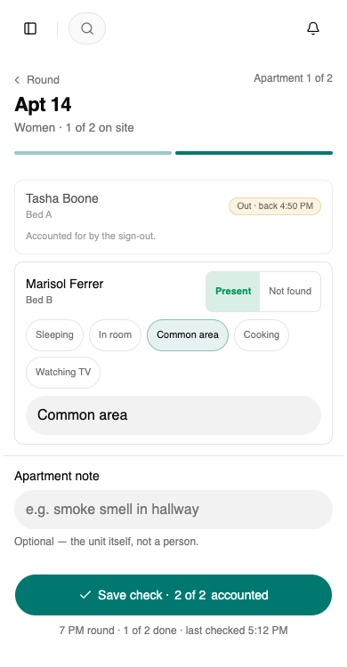

# SoberLife

Operations management for a sober living facility: the app that replaces the paper
binders, whiteboards and group texts a house currently runs on.

Staff run the day-to-day from one place: who is in which bed, the hourly rounds, sign-outs
and returns, the schedule and its rolls, community service hours, maintenance and the fee
ledger. Two design pressures shape everything. **Speed at the point of entry**, because a
tech logging a resident is standing in a hallway with a phone, and **defensibility after
the fact**, because every record is potential evidence for a licensing audit or a probation
officer. Records are append-only in spirit: corrections are new entries with a reason,
never silent overwrites.


> **Architecture, the domain glossary, and the reasoning behind every decision live in
> [CLAUDE.md](CLAUDE.md).** This file only gets you running. When the two disagree,
> CLAUDE.md wins.

## Screens

The dashboard above is the landing page, and it leads with the loudest true thing before
anything about money: a resident the last round could not find.

| | |
|---|---|
|  |  |
| **The census board.** Absence is what has to read at a glance: a bed free, a bed out of service carrying its reason, somebody overdue back. A tile with no chip on it is fine, which is what keeps a quiet house looking quiet. | **An hourly round, on the phone it is walked with.** Tasha is already accounted for by her open sign-out, so the round only asks about whoever is left. |

Every name is seed data.

## The parts worth reading

For anyone evaluating the code rather than running it, these are the decisions the domain forced.

**Corrections are new rows.** A licensing auditor or a probation officer may eventually read these
records, so history can't be editable. A correction is an append with a reason attached, never an
overwrite, which means the schema can answer "what did staff believe at 9pm, and when did that
change?" long after the fact.

**Row-level security, the audit log and soft deletes live at the database and Prisma-client level,
not in route handlers.** Per-route checks are only as good as the least careful endpoint anyone adds
later. Pushing them down means a new route can't forget them.

**The resident app doesn't exist yet, on purpose.** `client/` is deliberately empty and separate
from `admin/` so that neither staff code nor a staff-only data shape can ever end up in a resident's
bundle. The boundary was drawn before there was anything to put on the other side of it.

**There is no test framework, and that's a decision rather than a gap.** Each module ships assertion
scripts that run against a live database and check the invariants the domain actually depends on:
cohort separation, append-only history, RLS, derived states. Mocked unit tests would have verified
that the code does what it says; these verify that the database can't be talked into an illegal
state. See [Verification](#verification).

**Compliance shapes the logging, not just the auth.** 42 CFR Part 2 treats the mere fact of someone's
enrollment as protected, which rules out names in logs, URLs, analytics, and third-party services,
including LLMs. Log ids, never identities.

## Stack

| Folder | What it is |
|---|---|
| `server/` | Node + Express API. Prisma 7 over PostgreSQL. The only thing that touches the database. |
| `admin/` | Staff app (admin, house manager, tech) — Nuxt 4, Tailwind v4, vendored shadcn-vue. |
| `client/` | Resident-facing app — **not created yet**, deliberately. Separate from `admin/` so no staff code ever ships in a resident's bundle. |

Plain JavaScript throughout, no TypeScript and no build step on the server. Row-level
security, an audit log and soft deletes are enforced at the database and Prisma-client
level rather than per route.

## Prerequisites

- **Node 22**
- **Docker Desktop** — Postgres runs in a container; there is no local Postgres.
  It does not start on login, so `open -a Docker` first and give it ~20s.

## Running it

```bash
# 1. Database + schema + demo data
cd server
cp .env.example .env          # local Docker throwaways; fine as-is for development
npm install                   # postinstall generates the Prisma client
npm run db:up                 # postgres:17 on 5432 — user/pass/db all "soberlife"
npx prisma migrate deploy
node scripts/seed.js

# 2. The API                  → http://localhost:3001
npm run dev

# 3. The admin app            → http://localhost:3000
cd ../admin && npm install && npm run dev
```

Dev sign-ins, all with password `soberlife-dev-1234`:

| Email | Role |
|---|---|
| `admin@facility.test` | Admin |
| `manager@facility.test` | House manager |
| `tech@facility.test` | Staff / tech |

Seed data only. `seed.js` refuses to run when `NODE_ENV=production`, and it leaves any
account you created with `scripts/create-user.js` alone.

The seeded house is deliberately messy so every screen has something to show: an overdue
sign-out, an apartment past its hourly check, a resident nobody could find, a missed round,
a bed out of service, someone awaiting a bed, and an un-taken roll.

## Verification

There is no test framework. Instead each module ships a script of assertions that runs
against a **live database** and checks the invariants the domain depends on: cohort
separation, append-only history, RLS, the derived states. They are the regression suite;
run them after any schema change.

```bash
cd server
node scripts/verify-checks.js       # e.g. 65 assertions on the hourly round
```

The full chain, and the order it must run in, is in CLAUDE.md under "Running it".

Two things that will bite you:

- **`npm run verify:constraints` TRUNCATEs as it runs.** Reseed before running anything
  else, or every login assertion fails. Point it only at a disposable database.
- **Don't reseed a database someone else is using.** The suites run fine against a scratch
  database in the same container. See CLAUDE.md for the two-line setup.

## Working on it

`main` is the shared line. Branch for a piece of work, open a pull request, merge it,
delete the branch. Keep branches short-lived. A branch that sits for weeks is where merge
pain comes from.

**Only one person changes the Prisma schema at a time.** Migrations are timestamped,
ordered, and immutable once applied; two created in parallel merge cleanly as files and
then disagree about what state the database is in. If it happens anyway, drop your local
database and re-run `prisma migrate deploy`. It is disposable seed data, which is the
whole point.

Update CLAUDE.md when scope, decisions or the stack change. It is the durable record, not
the conversation.

## Compliance posture

Treat all resident data as regulated health information. Drug screen results, medication
records, and **the mere fact that someone is in this program** are protected. 42 CFR
Part 2 covers substance use disorder treatment records and is stricter than HIPAA.

In practice, for anyone contributing: **no PHI in logs, error messages, URLs, analytics, or
anything sent to a third party, including an LLM.** Log ids, never names or results.
Authorization is enforced server-side; hiding something in the client is presentation, not
protection. The full posture, and the open questions still to be answered with the facility,
are in CLAUDE.md.
